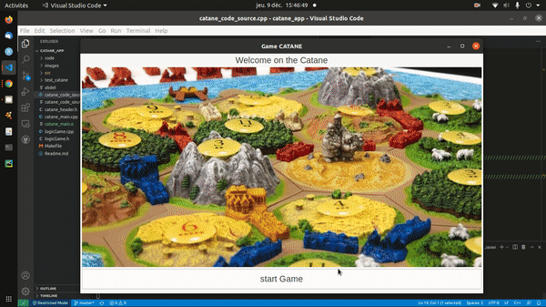

# Catane Game

In Vampire, players assume the personas of vampires — the immortal bloodsuckers of the horror genre — and guide these characters through a world virtually identical to our own. But these aren’t quite the vam- pires you might know from Dracula or Twilight. The vampires that exist now — or Kindred, or Cainites, as they commonly call themselves — are both similar to and different from what we might expect. In many ways, vampires resemble the familiar monsters of myth,cinema, folklore, and fiction. However — as many an intrepid vampire-hunter has learned to his sorrow — not all of the stories about vampires are true. 

(https://catanuniverse.com/fr/)

## Getting Started

These instructions will get you a copy of the project up and running on your local machine for running and testing purposes.

### Building

A step by step series of examples that tell you how to get the executable files

In the project root directory, generate the *Makefile* 

Before the installation, make sure you have C++ 2011 version and Gtkmm 3.0.

`clone https://github.com/abdeljalil-senhaji/Catane_Game`

`cd catane_app`

To get started, write in the console the following command:

`make clean`

`make`

`./catane`

Please, see this following example:

## Tree view

* `/src` : the headers and sources files relating to the view part of the project
* `/images` : the images necesary for the project
* `/make` : the Make script to find the GTKmm library
* `/Document` : the documents used for the catane game rules

## Built With

* [Code::visual::studio](https://code.visualstudio.com/) - The IDE used
* [Make](https://www.gnu.org/software/make/) - Build system
* [GTKmm](https://gtkmm.org/en/) - Graphical library used
* [Cairo](https://www.cairographics.org/) - library used dessing
* [Pango](https://pango.gnome.org/) - library used backegrond
* [GitHub](https://github.com/abdeljalil-senhaji/Catane_Game) - Our original repository

# Code

The interface was developed in oriented-object format, each window is a class. Each class contains methods for drawings.

## Author

* **Senhaji Rachik Abdeljalil** 

