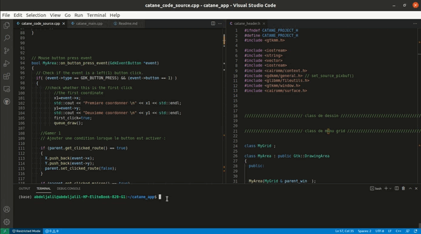

# Catane Game

DeColonization and management of the natural resources of an island. The winner is the one who accumulates 10 victory points. We develop on the island by placing settlements, building roads, collecting natural resources that ensure expansion. A mechanism of medium complexity, which is renewed thanks to the variable construction of the topology of the island. You never play the same part, even if the mechanisms are repeated. The outcome of the game depends heavily on the initial placement of settlements. A plethora of base game expansions have appeared on the market. A classic, practically entered in the pantheon of board games. (https://catanuniverse.com/fr/)

## Getting Started

These instructions will get you a copy of the project up and running on your local machine for running and testing purposes.

## Building

A step by step series of examples that tell you how to get the executable files

In the project root directory, generate the *Makefile* 

Before the installation, make sure you have C++ 2011 version and Gtkmm 3.0.

`clone git https://github.com/abdeljalil-senhaji/Catane_Game`

`cd catane_app`

To get started, write in the console the following command:

`make clean`

`make`

`./catane`

Or simplifiy:

`make clean; make; ./catane;`

Please, see this following example:

## Tree view

* `/src` : the headers and sources files of the project
* `/images` : the images necesary for the project
* `/make` : the Make script to find the GTKmm library
* `/Document` : the documents used for the catane game rules

## Built With

* [Code::visual::studio](https://code.visualstudio.com/) - The IDE used
* [Make](https://www.gnu.org/software/make/) - Build system
* [GTKmm](https://gtkmm.org/en/) - Graphical library used
* [Cairo](https://www.cairographics.org/) - library used dessing
* [Pango](https://pango.gnome.org/) - library used backegrond
* [GitHub](https://github.com/abdeljalil-senhaji/Catane_Game) - Our original repository

# Code

The interface was developed in oriented-object format, each window is a class. Each class contains methods for drawings.

## Author

* **Senhaji Rachik Abdeljalil** 

